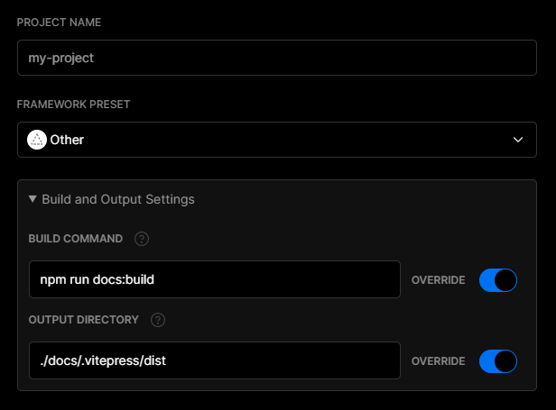

# Deploying

The following guides are based on some shared assumptions:

- You are placing your docs inside the `docs` directory of your project;
- You are using the default build output location (`.vitepress/dist`);
- VitePress is installed as a local dependency in your project, and you have setup the following npm scripts:

```json
{
  "scripts": {
    "docs:build": "vitepress build docs",
    "docs:serve": "vitepress serve docs"
  }
}
```

## Building The Docs

You may run `yarn docs:build` command to build the docs.

```bash
$ yarn docs:build
```

By default, the build output will be placed at `.vitepress/dist`. You may deploy this `dist` folder to any of your preferred platforms.

### Testing The Docs Locally

Once you've built the docs, you may test them locally by running `yarn docs:serve` command.

```bash
$ yarn docs:build
$ yarn docs:serve
```

The `serve` command will boot up local static web server that serves the files from `.vitepress/dist` at http://localhost:5000. It's an easy way to check if the production build looks OK in your local environment.

You may configure the port of the server py passing `--port` flag as an argument.

```json
{
  "scripts": {
    "docs:serve": "vitepress serve docs --port 8080"
  }
}
```

Now the `docs:serve` method will launch the server at http://localhost:8080.

## GitHub Pages

1. Set the correct `base` in `docs/.vitepress/config.js`.

   If you are deploying to `https://<USERNAME>.github.io/`, you can omit `base` as it defaults to `'/'`.

   If you are deploying to `https://<USERNAME>.github.io/<REPO>/`, for example your repository is at `https://github.com/<USERNAME>/<REPO>`, then set `base` to `'/<REPO>/'`.

2. Inside your project, create `deploy.sh` with the following content (with highlighted lines uncommented appropriately), and run it to deploy:

```bash{13,20,23}
#!/usr/bin/env sh

# abort on errors
set -e

# build
npm run docs:build

# navigate into the build output directory
cd docs/.vitepress/dist

# if you are deploying to a custom domain
# echo 'www.example.com' > CNAME

git init
git add -A
git commit -m 'deploy'

# if you are deploying to https://<USERNAME>.github.io
# git push -f git@github.com:<USERNAME>/<USERNAME>.github.io.git master

# if you are deploying to https://<USERNAME>.github.io/<REPO>
# git push -f git@github.com:<USERNAME>/<REPO>.git master:gh-pages

cd -
```

::: tip
You can also run the above script in your CI setup to enable automatic deployment on each push.
:::

### GitHub Pages and Travis CI

1. Set the correct `base` in `docs/.vitepress/config.js`.

   If you are deploying to `https://<USERNAME or GROUP>.github.io/`, you can omit `base` as it defaults to `'/'`.

   If you are deploying to `https://<USERNAME or GROUP>.github.io/<REPO>/`, for example your repository is at `https://github.com/<USERNAME>/<REPO>`, then set `base` to `'/<REPO>/'`.

2. Create a file named `.travis.yml` in the root of your project.

3. Run `yarn` or `npm install` locally and commit the generated lockfile (that is `yarn.lock` or `package-lock.json`).

4. Use the GitHub Pages deploy provider template, and follow the [Travis CI documentation](https://docs.travis-ci.com/user/deployment/pages/).

```yaml
language: node_js
node_js:
  - lts/*
install:
  - yarn install # npm ci
script:
  - yarn docs:build # npm run docs:build
deploy:
  provider: pages
  skip_cleanup: true
  local_dir: docs/.vitepress/dist
  # A token generated on GitHub allowing Travis to push code on you repository.
  # Set in the Travis settings page of your repository, as a secure variable.
  github_token: $GITHUB_TOKEN
  keep_history: true
  on:
    branch: master
```

## GitLab Pages and GitLab CI

1. Set the correct `base` in `docs/.vitepress/config.js`.

    If you are deploying to `https://<USERNAME or GROUP>.gitlab.io/`, you can omit `base` as it defaults to `'/'`.

    If you are deploying to `https://<USERNAME or GROUP>.gitlab.io/<REPO>/`, for example your repository is at `https://gitlab.com/<USERNAME>/<REPO>`, then set `base` to `'/<REPO>/'`.

2. Set `dest` in `.vitepress/config.js` to `public`.

3. Create a file called `.gitlab-ci.yml` in the root of your project with the content below. This will build and deploy your site whenever you make changes to your content:

```yaml
image: node:10.22.0
pages:
  cache:
    paths:
      - node_modules/
  script:
    - yarn install # npm install
    - yarn docs:build # npm run docs:build
  artifacts:
    paths:
      - public
  only:
    - master
```

## Netlify

1. On [Netlify](https://netlify.com), setup up a new project from GitHub with the following settings:

- **Build Command:** `vitepress build docs` or `yarn docs:build` or `npm run docs:build`
- **Publish directory:** `docs/.vitepress/dist`

2. Hit the deploy button.

## Google Firebase

1. Make sure you have [firebase-tools](https://www.npmjs.com/package/firebase-tools) installed.

2. Create `firebase.json` and `.firebaserc` at the root of your project with the following content:

 `firebase.json`:

  ```json
  {
    "hosting": {
      "public": "./docs/.vitepress/dist",
      "ignore": []
    }
  }
  ```

  `.firebaserc`:

  ```js
  {
   "projects": {
     "default": "<YOUR_FIREBASE_ID>"
   }
  }
  ```

3. After running `yarn docs:build` or `npm run docs:build`, deploy using the command `firebase deploy`.

## Surge

1. First install [surge](https://www.npmjs.com/package/surge), if you haven’t already.

2. Run `yarn docs:build` or `npm run docs:build`.

3. Deploy to surge by typing `surge docs/.vitepress/dist`.

You can also deploy to a [custom domain](http://surge.sh/help/adding-a-custom-domain) by adding `surge docs/.vitepress/dist yourdomain.com`.

## Heroku

1. Install [Heroku CLI](https://devcenter.heroku.com/articles/heroku-cli).

2. Create a Heroku account by [signing up](https://signup.heroku.com).

3. Run `heroku login` and fill in your Heroku credentials:

```bash
$ heroku login
```

4. Create a file called `static.json` in the root of your project with the below content:

`static.json`:

```json
{
  "root": "./docs/.vitepress/dist"
}
```

This is the configuration of your site; read more at [heroku-buildpack-static](https://github.com/heroku/heroku-buildpack-static).

5. Set up your Heroku git remote:

```bash
# version change
$ git init
$ git add .
$ git commit -m "My site ready for deployment."

# creates a new app with a specified name
$ heroku apps:create example

# set buildpack for static sites
$ heroku buildpacks:set https://github.com/heroku/heroku-buildpack-static.git
```

6. Deploy your site:

```bash
# publish site
$ git push heroku master

# opens a browser to view the Dashboard version of Heroku CI
$ heroku open
```

## Vercel

To deploy your VitePress app with a [Vercel for Git](https://vercel.com/docs/git), make sure it has been pushed to a Git repository.

Go to https://vercel.com/import/git and import the project into Vercel using your Git of choice (GitHub, GitLab or BitBucket). Follow the wizard to select the project root with the project's `package.json` and override the build step using `yarn docs:build` or `npm run docs:build` and the output dir to be `./docs/.vitepress/dist`



After your project has been imported, all subsequent pushes to branches will generate Preview Deployments, and all changes made to the Production Branch (commonly "main") will result in a Production Deployment.

Once deployed, you will get a URL to see your app live, such as the following: https://vitepress.vercel.app
